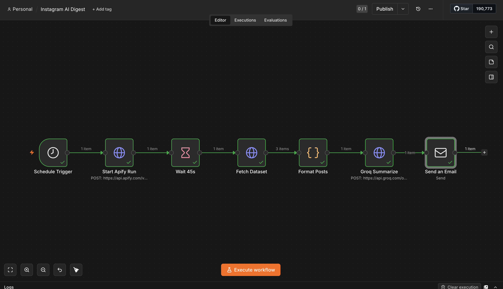

# Instagram AI Digest Agent

An autonomous agent that monitors Instagram accounts of AI creators, summarizes their posts using an LLM, and delivers a daily educational digest by email — with no manual intervention.

---

## How it works

1. Scrapes posts from target Instagram accounts via the Apify cloud scraping API
2. Summarizes content using LangChain + Groq (LLaMA 3.3 70B) with a structured prompt that defines every tool, model, and concept mentioned
3. Sends a formatted HTML email digest via Gmail SMTP
4. Runs daily on a GitHub Actions cron schedule — no laptop required

---

## Projects

### Python Agent
**`instagram_ai_agent/`**

**Stack:** Python · LangChain · Groq API · Apify · GitHub Actions · smtplib

**Setup:**
```bash
cd instagram_ai_agent
pip install -r requirements.txt
cp .env.example .env   # add GROQ_API_KEY, GMAIL_APP_PASSWORD, APIFY_API_TOKEN
python main.py --now   # run immediately
```

**Config** (`config.json`):
```json
{
  "instagram_accounts": ["mattmurphyai", "kernx.ai", "sayed.developer"],
  "lookback_hours": 24,
  "email": { "from": "you@gmail.com", "to": "you@gmail.com" }
}
```

**Cloud deployment:** Secrets are stored in GitHub Actions (never committed). The workflow runs at 05:00 UTC (08:00 EAT) daily via `.github/workflows/instagram-digest.yml`.

---

### n8n Workflow
**`instagram_ai_agent/n8n_workflow.json`**

The same pipeline rebuilt as a visual no-code workflow in n8n — importable in one click.

**Pipeline:**
```
Schedule Trigger → Start Apify Run → Wait 45s → Fetch Dataset → Format Posts → Groq Summarize → Send Email
```



**Import into n8n:**
1. Open n8n → New Workflow → `...` menu → Import from JSON
2. Paste contents of `n8n_workflow.json`
3. Add your Apify token, Groq API key, and SMTP credentials
4. Click Test workflow

**Stack:** n8n · Docker · Apify API · Groq API · SMTP

---

## Sample Output

**Subject:** Morning AI & Tech Digest — Tuesday, June 02 2026

---

**Key Highlights**
- `@mattmurphyai` discussed sharding and multi-region support for scaling databases and reducing latency
- `@kernx.ai` explained how LLMs learn patterns rather than relying on memorization, enabling them to generate novel responses
- `@sayed.developer` highlighted the ease of integrating voice features into chatbots using the Eleven Labs Speech Engine

---

**@kernx.ai — AI Educator**

*What they said:* Discussed the fundamental difference between memorization and pattern learning in LLMs — that the power of these models lies not in storing vast amounts of information, but in learning patterns and relationships that allow them to generate novel responses.

*Breaking it down:*
- **Large Language Models (LLMs)** — AI models trained on vast text data to learn the patterns and structure of language, enabling them to predict and generate text rather than recall stored answers
- **Pattern learning vs. memorization** — Pattern learning lets a model generalize to new, unseen situations. Memorization would only allow it to recall previously seen information — useless for any prompt it hasn't seen before

*Notable quote:* "If AI relied purely on memorization, it would fail the moment you asked a question it had never seen before."

---

**@mattmurphyai — Database & Performance**

*Breaking it down:*
- **Sharding** — Dividing a large database into smaller pieces (shards) to improve query performance and scalability under high traffic
- **Multi-region support** — Deploying infrastructure across geographic regions so global users experience low latency, often combined with CDNs or edge computing

---

**@sayed.developer — Voice & Chatbots**

*Breaking it down:*
- **Eleven Labs Speech Engine** — An AI-powered tool for adding voice/speech capabilities to applications. Reduces the complexity of building voice interfaces for chatbots from weeks to hours

---

**Concept Glossary**
- **Sharding** — Database partitioning technique for scalability
- **PostgreSQL** — Open-source relational database known for reliability at scale
- **LLMs** — AI models that learn language patterns to generate responses
- **Pattern learning** — Generalizing from data rather than memorizing it
- **Eleven Labs Speech Engine** — Voice integration tool for AI applications

**Action Items**
1. Explore sharding if your database is becoming a bottleneck under load
2. Dive deeper into how LLMs learn — understanding this separates good prompt engineers from great ones
3. Try the Eleven Labs Speech Engine to add voice to your next chatbot project

---

## Requirements

- Python 3.10+
- Docker (for n8n local setup)
- API keys: Groq (free), Apify (free tier), Gmail App Password
